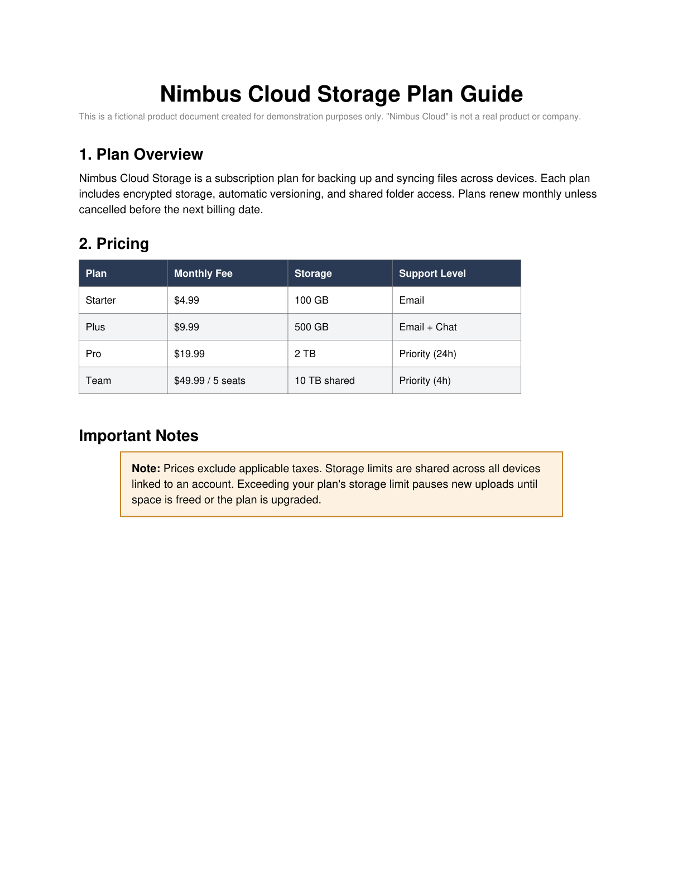

# Example: Nimbus Storage Plan

A worked example of what `vich` produces, end to end.

`nimbus_storage_plan.pdf` is a **fictional** 2-page product guide ("Nimbus
Cloud" is not a real company/product) generated purely for this repo, so it
carries no copyright or licensing concerns. It deliberately exercises the
layout elements vich is meant to handle well:

| Page | Element | Expected `content_type` |
|---|---|---|
| 1 | "Plan Overview" paragraph | `paragraph` |
| 1 | "Pricing" table | `table` |
| 1 | "Important Notes" boxed warning | `boxed_section` |
| 2 | "Fair Use Policy" bullet list | `list` |
| 2 | "Cancellation & Refunds" paragraph + footnote | `paragraph` |

## Files

- [`nimbus_storage_plan.pdf`](nimbus_storage_plan.pdf) — the input document
- [`nimbus_storage_plan.jsonl`](nimbus_storage_plan.jsonl) — actual output from
  `vich parse examples/nimbus_storage_plan.pdf`, using `gpt-4.1-mini`
- [`chunk_visualization.html`](chunk_visualization.html) — open this in a
  browser to see each source page next to the chunks vich extracted from it
  (see screenshot below)
- `generate_sample_pdf.py` / `generate_chunk_visualization.py` — the scripts
  that produced the two files above, kept so the example can be regenerated

## Reproducing

```bash
uv sync --extra dev
pip install reportlab  # docs-only, not a project dependency

python examples/generate_sample_pdf.py
uv run vich parse examples/nimbus_storage_plan.pdf --output-dir examples --overwrite
python examples/generate_chunk_visualization.py
open examples/chunk_visualization.html
```

## What the visualization shows

Each source page is rendered on the left; every card on the right is one
chunk vich extracted from that page, color-coded by `content_type`, with its
3-level heading breadcrumb, body (or table, rendered from `table_markdown`),
and extracted keywords.



For example, the pricing table on page 1 becomes a single `table` chunk that
keeps its column headers instead of being flattened into unreadable text:

```
| Plan    | Monthly Fee       | Storage      | Support Level  |
|---------|-------------------|--------------|-----------------|
| Starter | $4.99             | 100 GB       | Email           |
| Plus    | $9.99             | 500 GB       | Email + Chat    |
| Pro     | $19.99            | 2 TB         | Priority (24h)  |
| Team    | $49.99 / 5 seats  | 10 TB shared | Priority (4h)   |
```

...and the boxed warning right below it becomes its own `boxed_section`
chunk with a heading breadcrumb (`Pricing › Important Notes`) rather than
being merged into the surrounding paragraph text.
