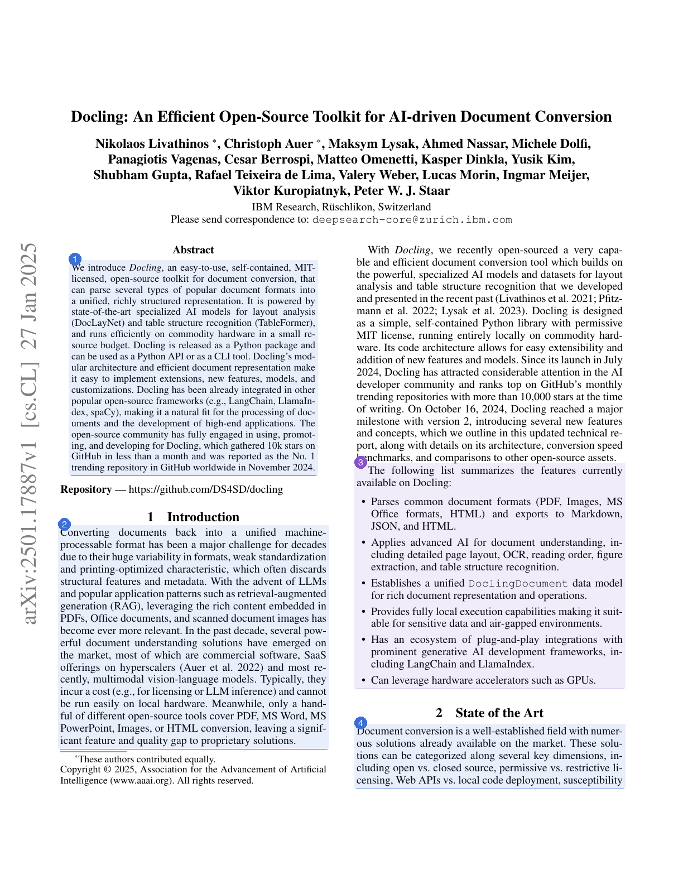

# Example: Docling paper

A worked example of what `vich` produces, end to end, run against a real,
dense, two-column academic PDF.

`docling_example.pdf` is *"Docling: An Efficient Open-Source Toolkit for
AI-driven Document Conversion"* (Livathinos, Auer, et al., IBM Research,
[arXiv:2501.17887v1](https://arxiv.org/abs/2501.17887v1)), licensed
[CC BY 4.0](http://creativecommons.org/licenses/by/4.0/), which permits
redistribution with attribution — hence it's committed here as-is.

It's a good stress test precisely because it's *not* a clean, single-column
synthetic doc: two-column layout, hyphenated line wraps, inline citations,
figures, and a real benchmark table.

## Files

- [`docling_example.pdf`](docling_example.pdf) — the input paper
- [`docling_example.jsonl`](docling_example.jsonl) — actual output from
  `vich parse examples/docling_example.pdf`, using `gpt-4.1-mini`
  (33 chunks from 8 pages, `batch_size=2`, including 1 auto-recovered chunk)
- [`chunk_visualization.html`](chunk_visualization.html) — open this in a
  browser: a document outline linking to every chunk, and each source page
  **with a numbered box + cropped image for every chunk vich found on it**,
  next to a card per chunk (see screenshot below)
- `generate_chunk_visualization.py` — the script that produced the
  visualization + `assets/`, kept so the example can be regenerated

Re-running `vich parse` won't reproduce this exact JSONL byte-for-byte —
chunk boundaries and content-type choices can vary slightly run to run —
but chunk *wording* should stay close to verbatim, and dropped content
(when it happens) should get recovered rather than silently lost; see below.

## Reproducing

```bash
uv sync --extra dev

curl -sL "https://arxiv.org/pdf/2501.17887v1" -o examples/docling_example.pdf
uv run vich parse examples/docling_example.pdf --output-dir examples --overwrite
python examples/generate_chunk_visualization.py
open examples/chunk_visualization.html
```

## Four fixes this example surfaced, in order

**1. Chunk text is grounded in the PDF's own text, not re-typed from the
image.** An early version showed the VLM paraphrasing dense sentences —
e.g. it once rendered the "Parser Backends" section as *"...comparatively
**easier** to parse,"* when the source actually says *"...comparatively
**inexpensive** to parse."* The chunker now also sends the PDF's own
extracted text (via PyMuPDF) alongside the page images, and instructs the
model to copy `chunk_text` verbatim from it — using the images only for
layout, reading order, headings, and table/figure structure. This only
grounds *wording*; the model still decides chunk *boundaries* and
`content_type` itself.

**2. A dropped paragraph is worse than a paraphrased one, and grounding
made that more likely.** A longer prompt (more page images *and* more
extracted text per call) turned out to have its own failure mode: on one
run, the entire "1 Introduction" section vanished from the output — not
paraphrased, just absent from every chunk, even though the text was right
there in what was sent to the model. `batch_size` now defaults to 2
(smaller prompt per call) instead of 4, which reduces how often this
happens, but reducing isn't eliminating.

**3. So a batch-level coverage check isn't enough either — dropped content
needs to be recovered, not just flagged.** A first pass added a warning
when a whole *batch's* word coverage looked low. It missed the case above:
the batch that dropped the Introduction still scored 69% overall coverage
from its other, well-covered chunks — comfortably above a 50% warning
threshold that seemed reasonable until tested against a real drop.
A warning that doesn't reliably fire isn't a fix. `vich.chunking.recovery`
now checks coverage **per paragraph-ish block** (PyMuPDF's own layout
segmentation) instead of per batch, and inserts a fallback chunk built
from any block's exact text that the VLM's own chunks don't cover — see
`vich.chunking.recovery.find_missed_blocks` and the "Content recovery"
section of the [root README](../README.md#content-recovery). On the run
behind this JSONL, that caught a block the model skipped on page 1 (the
author list) — `docling_example_7`, `content_type: "paragraph"`,
`source_notes` starting `"Auto-recovered: ..."`.

**4. (Visualization-only) A chunk spanning a page break needs a box on
*both* pages, not one.** Batching more than one page into a single VLM
call exists specifically so content isn't artificially split just because
of where a page ends — and it works: `docling_example_3`'s chunk_text
correctly merges the tail of page 1 ("...susceptibility to hallucinations,
conversion quality...") with the start of page 2 ("The most popular
conversion tools today leverage vision-language models...") into one
coherent chunk. But the visualization's page-matching originally picked a
single "best" page per chunk, so a genuinely 2-page chunk showed a box on
only one of them — the other page's share looked abandoned, even though
`vich parse` had merged it correctly. `find_matching_pages` in
`generate_chunk_visualization.py` now tries several anchor points through
a chunk's own text (not just its first word) when matching a page, and
adds a second page when the winning page's match starts well into the
chunk *and* an earlier page independently matches the missing head with a
real (15%+ of the chunk, not just a few incidental words) share — a
looser bar produced two false 2-page splits on unrelated, non-adjacent
pages during testing, which is why it's this specific and not just "any
overlap." This was never a `vich` pipeline bug; the chunking was already
correct; only the box-drawing script needed to catch up.

## Document outline

`vich.outline` (a real library feature, not a docs-only script — see the
[root README](../README.md#outline)) assembles all 33 chunks' flat
`level_1/2/3_heading` labels into a tree:

```bash
uv run vich outline examples/docling_example.jsonl
```

```text
- Docling: An Efficient Open-Source Toolkit for AI-driven Document Conversion
  - Abstract (1 chunk)
  - Introduction (1 chunk)
    - Features (1 chunk)
  - State of the Art (2 chunks)
  - Design and Architecture (2 chunks)
    - Docling Document (2 chunks)
  - Parser Backends
    - Parser Backends (1 chunk)
    - PDF Backends (1 chunk)
    - Other Backends (1 chunk)
  ...
```

The visualization's "Document outline" section renders the same tree, with
each heading linking down to its chunk's card.

## What the visualization shows

Color shows the **heading hierarchy**, not `content_type`: every distinct
level_2 section gets its own color (adjacent sections are deliberately
spread far apart on the hue wheel — a golden-angle hue step, not an even
360/n one, so *neighboring* sections stay visually distinct instead of
landing next to each other in hue too), and cards on the right are grouped
and bracketed by their level_2/level_3 heading pair, not just listed flat
with a breadcrumb line each. `content_type` still shows as a text badge on
each card — it's just not what color means anymore.

Each source page is rendered on the left with a numbered box (colored by
section) around every chunk found on it; the matching numbered card on the
right — clustered under its section's colored bracket — shows a cropped
thumbnail of that same region, the chunk's 3-level heading breadcrumb,
body (or table, rendered from `table_markdown`), and extracted keywords.



Every block of text on this page is claimed by a box, including the author
list at the top (chunk 8, magenta — "Design and Architecture," where its
first real chunk lands) — the one this run's recovery mechanism caught
after the VLM's own chunking skipped it.

> **Note:** `vich`'s chunk schema has no bounding-box field — the VLM
> reasons over the whole page image and returns text, not coordinates. The
> boxes/crops here are a docs-only convenience: `generate_chunk_visualization.py`
> estimates each one by matching the chunk's own text back onto the PDF's
> text layer, splitting into separate regions wherever the match crosses a
> column break or a large gap, extending upward for a `figure` chunk so the
> box lands on the whole figure, not just its caption (the VLM has nothing
> to transcribe from a figure's own graphic, so only the caption text
> matches directly), and drawing a box on *each* page a chunk genuinely
> spans (see fix 4 above) rather than picking a single "best" one. That
> only works for text-based PDFs, and it's not part of what `vich parse`
> outputs. (The outline above, and the content-recovery mechanism, *are*
> part of vich's actual output — not a docs convenience.)
>
> The search also isn't limited to a chunk's own declared `page_start` —
> **2 of this example's 33 chunks are labeled with the wrong page** by the
> VLM itself, so each chunk is matched against a small window of nearby
> pages and shown wherever it actually lands, with a note on the card when
> that differs from vich's own label. That's a real accuracy limitation of
> the current chunker worth knowing about if you depend on
> `page_start`/`page_end` for precise citations — none of the three fixes
> above touch page attribution, which is a separate self-reported field.
