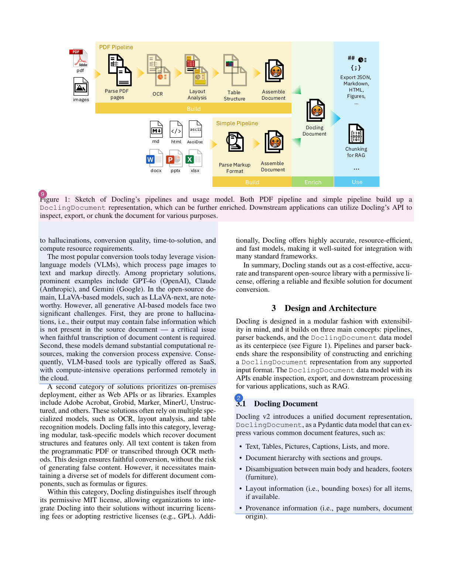

# Example: Docling paper

A worked example of what `vich` produces, end to end, run against a real,
dense, two-column academic PDF.

`docling_example.pdf` is *"Docling: An Efficient Open-Source Toolkit for
AI-driven Document Conversion"* (Livathinos, Auer, et al., IBM Research,
[arXiv:2501.17887v1](https://arxiv.org/abs/2501.17887v1)), licensed
[CC BY 4.0](http://creativecommons.org/licenses/by/4.0/), which permits
redistribution with attribution — hence it's committed here as-is.

It's a good stress test precisely because it's *not* a clean, single-column
synthetic doc: two-column layout, hyphenated line wraps, inline citations,
figures, and a real benchmark table.

## Files

- [`docling_example.pdf`](docling_example.pdf) — the input paper
- [`docling_example.jsonl`](docling_example.jsonl) — actual output from
  `vich parse examples/docling_example.pdf`, using `gpt-4.1-mini`
  (16 chunks from 8 pages)
- [`chunk_visualization.html`](chunk_visualization.html) — open this in a
  browser to see each source page **with a numbered box around every
  chunk vich found on it**, next to a card per chunk (see screenshot below)
- `generate_chunk_visualization.py` — the script that produced the
  visualization + `assets/`, kept so the example can be regenerated

## Reproducing

```bash
uv sync --extra dev
pip install pillow  # docs-only, not a project dependency

curl -sL "https://arxiv.org/pdf/2501.17887v1" -o examples/docling_example.pdf
uv run vich parse examples/docling_example.pdf --output-dir examples --overwrite
python examples/generate_chunk_visualization.py
open examples/chunk_visualization.html
```

## What the visualization shows

Each source page is rendered on the left with a numbered, color-coded box
around every chunk found on it; the matching numbered card on the right
shows that chunk's 3-level heading breadcrumb, body (or table, rendered
from `table_markdown`), and extracted keywords.

> **Note:** `vich`'s chunk schema has no bounding-box field — the VLM
> reasons over the whole page image and returns text, not coordinates. The
> boxes here are a docs-only convenience: `generate_chunk_visualization.py`
> estimates each one by matching the chunk's own text back onto the PDF's
> text layer, splitting into separate boxes wherever the match crosses a
> column break or a large gap. That only works for text-based PDFs, some
> heavily-paraphrased chunks won't get a confident enough match to draw at
> all, and it's not part of what `vich parse` outputs.



For example, "Table 1" becomes a single `table` chunk that keeps its column
headers instead of being flattened into unreadable text:

```
| Asset        | Version | OCR         | Layout          | Tables               |
|--------------|---------|-------------|-----------------|----------------------|
| Docling      | 2.5.2   | EasyOCR *   | default         | TableFormer (fast) * |
| Marker       | 0.3.10  | Surya *     | default         | default              |
| MinerU       | 0.9.3   | auto *      | doclayout_yolo  | rapid_table *        |
| Unstructured | 0.16.5  |             | hi_res with table structure          |
```

...and a figure caption on page 2 becomes its own `figure` chunk with a
heading breadcrumb, rather than being merged into the surrounding text.
