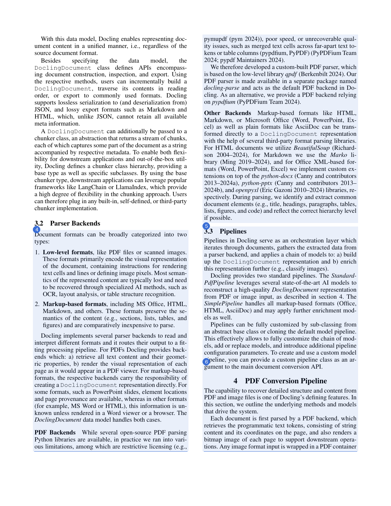

# Example: Docling paper

A worked example of what `vich` produces, end to end, run against a real,
dense, two-column academic PDF.

`docling_example.pdf` is *"Docling: An Efficient Open-Source Toolkit for
AI-driven Document Conversion"* (Livathinos, Auer, et al., IBM Research,
[arXiv:2501.17887v1](https://arxiv.org/abs/2501.17887v1)), licensed
[CC BY 4.0](http://creativecommons.org/licenses/by/4.0/), which permits
redistribution with attribution — hence it's committed here as-is.

It's a good stress test precisely because it's *not* a clean, single-column
synthetic doc: two-column layout, hyphenated line wraps, inline citations,
figures, and a real benchmark table.

## Files

- [`docling_example.pdf`](docling_example.pdf) — the input paper
- [`docling_example.jsonl`](docling_example.jsonl) — actual output from
  `vich parse examples/docling_example.pdf`, using `gpt-4.1-mini`
  (15 chunks from 8 pages)
- [`chunk_visualization.html`](chunk_visualization.html) — open this in a
  browser: a document outline linking to every chunk, and each source page
  **with a numbered box + cropped image for every chunk vich found on it**,
  next to a card per chunk (see screenshot below)
- `generate_chunk_visualization.py` — the script that produced the
  visualization + `assets/`, kept so the example can be regenerated

Re-running `vich parse` won't reproduce this exact JSONL byte-for-byte —
chunk boundaries and content-type choices can vary slightly run to run —
but chunk *wording* should stay close to verbatim; see below.

## Reproducing

```bash
uv sync --extra dev

curl -sL "https://arxiv.org/pdf/2501.17887v1" -o examples/docling_example.pdf
uv run vich parse examples/docling_example.pdf --output-dir examples --overwrite
python examples/generate_chunk_visualization.py
open examples/chunk_visualization.html
```

## Chunk text is grounded in the PDF's own text, not re-typed from the image

Earlier versions of this example showed the VLM paraphrasing dense
sentences instead of transcribing them — e.g. it once rendered the
"Parser Backends" section as *"...markup-based formats...which preserve
semantic content and are comparatively **easier** to parse"*, when the
paper actually says *"...comparatively **inexpensive** to parse."*

The chunker now also sends the PDF's own extracted text (via PyMuPDF)
alongside the page images, and instructs the model to copy `chunk_text`
verbatim from it — using the images only for layout, reading order,
headings, and table/figure structure, not for re-transcribing text it
already has exactly. `docling_example_3` (Parser Backends) now reads, word
for word:

> Document formats can be broadly categorized into two types:
> 1. Low-level formats, like PDF files or scanned images. [...]
> 2. Markup-based formats, including MS Office, HTML, Markdown, and others.
> These formats preserve the semantics of the content (e.g., sections,
> lists, tables, and figures) and are comparatively **inexpensive to parse**.

This only grounds *wording* — the model still decides chunk *boundaries*
and `content_type` itself, and those choices (like anything an LLM
produces) can still vary between runs. It also only helps for text-based
PDFs; a scanned page has no text layer to ground against, so the model
falls back to reading the image as before.

## Document outline

`vich.outline` (a real library feature, not a docs-only script — see the
[root README](../README.md#outline)) assembles all 15 chunks' flat
`level_1/2/3_heading` labels into a tree:

```bash
uv run vich outline examples/docling_example.jsonl
```

```text
- Docling: An Efficient Open-Source Toolkit for AI-driven Document Conversion
  - Introduction
    - Overview and Features (1 chunk)
  - State of the Art
    - Document Conversion Solutions and Challenges (1 chunk)
  - Design and Architecture
    - Docling Document Data Model (1 chunk)
    - Parser Backends (1 chunk)
    - Pipelines (1 chunk)
  - Performance
    - Benchmark Dataset and System Configurations (1 chunk)
    - Benchmarking Methodology (1 chunk)
    - Results (1 chunk)
    ...
```

The visualization's "Document outline" section renders the same tree, with
each heading linking down to its chunk's card.

## What the visualization shows

Each source page is rendered on the left with a numbered, color-coded box
around every chunk found on it; the matching numbered card on the right
shows a cropped thumbnail of that same region, the chunk's 3-level heading
breadcrumb, body (or table, rendered from `table_markdown`), and extracted
keywords.



> **Note:** `vich`'s chunk schema has no bounding-box field — the VLM
> reasons over the whole page image and returns text, not coordinates. The
> boxes/crops here are a docs-only convenience: `generate_chunk_visualization.py`
> estimates each one by matching the chunk's own text back onto the PDF's
> text layer, splitting into separate regions wherever the match crosses a
> column break or a large gap, and extending upward for a `figure` chunk
> so the box lands on the whole figure, not just its caption (the VLM has
> nothing to transcribe from a figure's own graphic, so only the caption
> text matches directly). That only works for text-based PDFs, and it's
> not part of what `vich parse` outputs. (The outline above *is* part of
> vich's actual output, not a docs convenience.)
>
> The search also isn't limited to a chunk's own declared `page_start` —
> **4 of this example's 15 chunks are labeled with the wrong page** by the
> VLM itself, so each chunk is matched against a small window of nearby
> pages and shown wherever it actually lands, with a note on the card when
> that differs from vich's own label. That's a real accuracy limitation of
> the current chunker worth knowing about if you depend on
> `page_start`/`page_end` for precise citations — the text-grounding fix
> above improved chunk *wording*, not page attribution.
